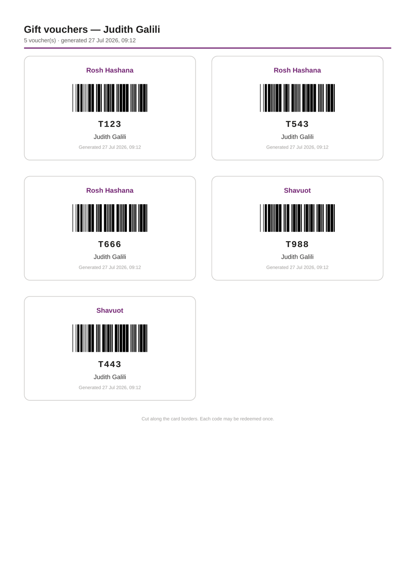

<div align="center">

# 🎟️ Gift Voucher Kiosk

**Scan an employee card, get a printable sheet of their gift vouchers.**

A Power Platform canvas app over a SharePoint list. One row can hold a dozen voucher codes
in one text column; this turns them into a dozen individual printable cards, each with its own
scannable barcode, in about four seconds — and marks the batch as collected so it can't be
printed twice.

[](LICENSE)
[](https://make.powerapps.com)
[](https://make.powerautomate.com)
[](#-what-it-costs)
[](#-what-it-costs)

</div>

---

## 🤔 What problem this solves

Gift vouchers arrive as a spreadsheet dump and end up in a SharePoint list that looks like this:

| Title | Employee | QRCodes | Printed |
|---|---|---|---|
| Rosh Hashana | Judith Galili | `T123;T543;T666` | No |
| Shavuot | Judith Galili | `T988;T443` | No |

Two rows. Five vouchers. Nobody can hand that to an employee.

What the handout desk actually needs is five separate cards, each scannable on its own, with the
employee's name on it so it can't be handed to the wrong person, and a timestamp so a reprint is
distinguishable from the original. Then the batch needs marking as collected, so the same person
can't come back an hour later and get a second set. That is all this does — but it does it from a
single card scan, with no typing.

---

## 🚶 What happens at the desk

<div align="center">

</div>

> Editable source: [`docs/images/journey.svg`](docs/images/journey.svg).

---

## 🗺️ How it works underneath

<div align="center">

</div>

> Editable source: [`docs/images/data-flow.svg`](docs/images/data-flow.svg).
> The long version, including why each choice was made: [`docs/ARCHITECTURE.md`](docs/ARCHITECTURE.md).

### What comes out

<div align="center">

</div>

Real output, not a mock-up — the PDF itself is [`docs/sample-vouchers.pdf`](docs/sample-vouchers.pdf).

**And the barcodes actually scan.** Not "should scan" — the sheet was rasterised at 300 dpi and
fed to an independent barcode reader, and every code came back exactly. The same markup was then
run through a live SharePoint tenant's Convert file service, and the codes still decoded from a
1568-pixel screenshot of the result, which is worse than anything a printer will produce:

<div align="center">

</div>

Re-run the check yourself on any code you like:

```bash
python tools/verify-barcodes.py T123 ABC-99
```

**The one piece of Power Fx worth reading** turns rows into cards:

```powerfx
ClearCollect(colCards,
    ForAll(
        Ungroup(
            AddColumns(colBatches, "Codes",
                Filter(Split(QRCodes, ";"), !IsBlank(Trim(Result)))
            ),
            "Codes"
        ),
        { Batch: Title, Code: Trim(Result), Employee: gblEmployeeName, Generated: gblGeneratedAt }
    )
)
```

`Split` makes a table out of one cell, `AddColumns` hangs it off its parent row, and `Ungroup`
flattens the lot. The `!IsBlank(Trim(Result))` guard is not decoration — a trailing semicolon in
the source data would otherwise print a blank voucher.

---

## ✨ What you get

|  | |
|---|---|
| ⌨️ **No typing at the desk** | A handheld keyboard-wedge scanner fills the box and the lookup fires on its own. The box re-arms itself for the next employee. |
| 🧾 **One card per code** | Batches are exploded, not listed. Five codes across two rows print as five cards. |
| 🖨️ **A real print layout** | A4 HTML with `page-break-inside: avoid`, so a card is never sliced in half by a page boundary. |
| 🔒 **Nothing leaves the tenant** | The barcodes are drawn out of HTML elements. No image service, no font download, no request of any kind. |
| 🚫 **Prints once** | A `Printed` flag is set only after the sheet actually exists. Scan again and the desk is told, by name, that it's already been collected. |
| 🕐 **Honest timestamps** | The time is stamped by the app when the employee scans, in their timezone — not by the server when the PDF finishes rendering. |
| 💸 **No premium connectors** | SharePoint's own Convert file action renders the PDF. Nothing here costs money. |
| 🧯 **Fails visibly** | An unknown card, an employee with no vouchers and a blank code all produce a message rather than a silent nothing. |

---

## 🚀 Getting started

**→ [Follow the setup guide](SETUP.md)** — about 20 minutes, and it assumes you have never built
a canvas app before.

The short version:

1. Add a **`Printed`** Yes/No column to your list, and a **`VoucherPDFs`** document library to the site.
2. Build the flow from [`flow/README.md`](flow/README.md) — nine actions, no premium connectors.
3. Build the app from [`app/README.md`](app/README.md) — every formula is written out in full.
4. Plug in a scanner and scan a card.

---

## 🧭 What's in here

```
app/            the canvas app — every screen, control and formula written out in full
                plus code39-table.json, the encoding the app builds barcodes from
flow/           the PDF flow, and the print stylesheet that gives the barcodes their widths
docs/           architecture, the diagrams, a real sample sheet and the PDF it came from
tools/          verify-barcodes.py — renders, prints, rasterises and decodes, so you can
                prove the table is right rather than take my word for it
SETUP.md        step-by-step, no Power Platform experience assumed
```

---

## 💰 What it costs

Nothing beyond licences you already have. SharePoint is the only connector the app uses, and the
flow's Convert file action is part of it. There is no Dataverse, no premium connector, no Azure
resource, and no third-party service of any kind — the barcodes are drawn locally, so a machine
with no internet access still prints a correct sheet.

---

## 🙅 Honest limitations

- **`Printed` records that a file was produced, not that a person received it.** A paper jam, the
  wrong tray, or a closed tab all leave an employee empty-handed with their vouchers marked as
  collected. Someone at the desk needs to know they can clear the flag, and that clearing it is
  two clicks for any site owner.
- **Nothing is marked as *redeemed*.** The flag stops a second print; it does nothing about a
  voucher that has already been spent. There is no issuance ledger and no one-time-use
  enforcement.
- **There is a small window where a sheet can print twice.** If the flow succeeds and the flag
  update then fails, the PDF exists and the rows are still unprinted.
  [The architecture doc](docs/ARCHITECTURE.md#the-printed-gate) explains why closing it properly
  means moving the marking into the flow, and what that costs.
- **Code 39 is uppercase-only.** Letters are upper-cased before encoding, so treat your codes as
  case-insensitive. Anything long, lowercase or heavily punctuated needs a different symbology —
  [the architecture doc](docs/ARCHITECTURE.md#swapping-the-symbology) covers the options.
- **Anyone who can open the app can print anyone's vouchers**, because the lookup key is an email
  address and the app does not check that the scanner belongs to the person holding it. This is a
  convenience for a staffed handout desk, not a self-service portal.
- **The card must encode the employee's email.** If your badges carry a payroll number instead,
  you need a lookup step — the architecture doc covers where it goes.
- **`number` is ignored.** The codes in `QRCodes` are the source of truth. If the two disagree,
  the app shows what it actually found rather than what the column claims.
- **Single-line text has a 255-character limit.** That is roughly 40 five-character codes per row.
  Past that, SharePoint truncates silently — split the batch across rows.

---

## 📄 Licence

[MIT](LICENSE) — do what you like with it.
