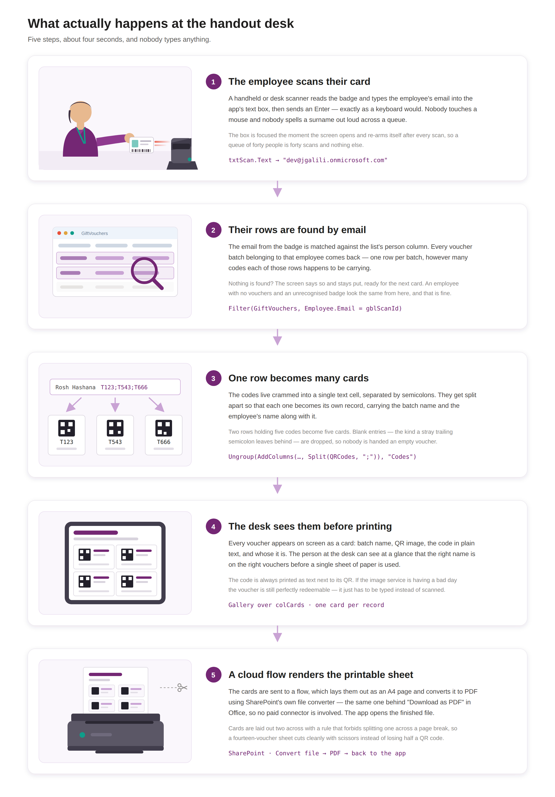
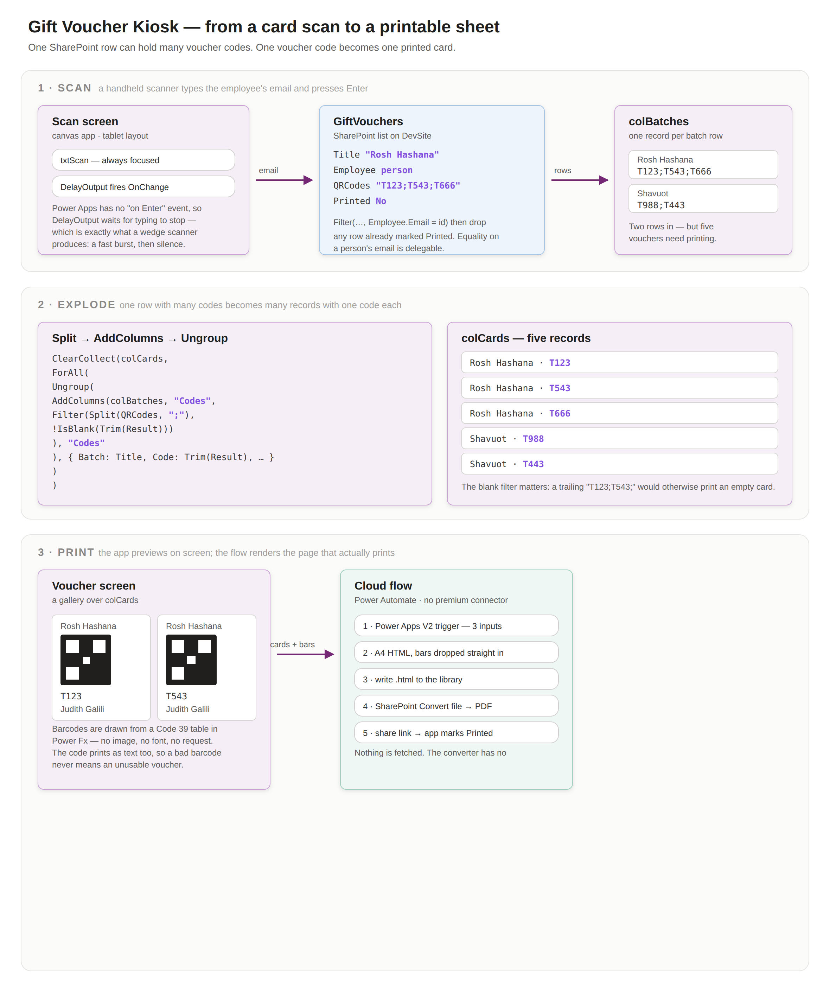

<div align="center">

# 🎟️ Gift Voucher Kiosk

**Scan an employee card, get a printable sheet of their gift vouchers.**

A Power Platform canvas app over a SharePoint list. One row can hold a dozen voucher codes
in one text column; this turns them into a dozen individual printable cards, each with its own
QR code, in about four seconds.

[](LICENSE)
[](https://make.powerapps.com)
[](https://make.powerautomate.com)
[](#-what-it-costs)

</div>

---

## 🤔 What problem this solves

Gift vouchers arrive as a spreadsheet dump and end up in a SharePoint list that looks like this:

| Title | Employee | QRCodes | number |
|---|---|---|---|
| Rosh Hashana | Judith Galili | `T123;T543;T666` | 3 |
| Shavuot | Judith Galili | `T988;T443` | 2 |

Two rows. Five vouchers. Nobody can hand that to an employee.

What the handout desk actually needs is five separate cards, each scannable on its own, with the
employee's name on it so it can't be handed to the wrong person, and a timestamp so a reprint is
distinguishable from the original. That is all this does — but it does it from a single card
scan, with no typing.

---

## 🚶 What happens at the desk

<div align="center">

</div>

> Editable source: [`docs/images/journey.svg`](docs/images/journey.svg).

---

## 🗺️ How it works underneath

<div align="center">

</div>

> Editable source: [`docs/images/data-flow.svg`](docs/images/data-flow.svg).
> The long version, including why each choice was made: [`docs/ARCHITECTURE.md`](docs/ARCHITECTURE.md).

**The one piece of Power Fx worth reading** turns rows into cards:

```powerfx
ClearCollect(colCards,
    ForAll(
        Ungroup(
            AddColumns(colBatches, "Codes",
                Filter(Split(QRCodes, ";"), !IsBlank(Trim(Result)))
            ),
            "Codes"
        ),
        { Batch: Title, Code: Trim(Result), Employee: gblEmployeeName, Generated: gblGeneratedAt }
    )
)
```

`Split` makes a table out of one cell, `AddColumns` hangs it off its parent row, and `Ungroup`
flattens the lot. The `!IsBlank(Trim(Result))` guard is not decoration — a trailing semicolon in
the source data would otherwise print a blank voucher.

---

## ✨ What you get

|  | |
|---|---|
| ⌨️ **No typing at the desk** | A handheld keyboard-wedge scanner fills the box and the lookup fires on its own. The box re-arms itself for the next employee. |
| 🧾 **One card per code** | Batches are exploded, not listed. Five codes across two rows print as five cards. |
| 🖨️ **A real print layout** | The flow builds A4 HTML with `page-break-inside: avoid`, so cards never split across pages. |
| 🕐 **Honest timestamps** | The time is stamped by the app when the employee scans, in their timezone — not by the server when the PDF finishes rendering. |
| 💸 **No premium connectors** | SharePoint's own Convert file action does the PDF. Nothing here costs money. |
| 🧯 **Fails visibly** | Unknown card, no vouchers, blank codes and flow errors all produce a message, not a silent nothing. |

---

## 🚀 Getting started

**→ [Follow the setup guide](SETUP.md)** — about 20 minutes, and it assumes you have never built
a canvas app before.

The short version:

1. Make sure your list has `Title` (text), `Employee` (person), `QRCodes` (text) and optionally `number`.
2. Import [`flow/GenerateGiftVoucherPDF.zip`](flow/) into Power Automate and point it at your site.
3. Import the app, connect it to your list, and set the flow reference.
4. Plug in a scanner and scan a card.

---

## 🧭 What's in here

```
app/            the canvas app, plus every formula written out in full
flow/           the Power Automate flow: importable package and readable definition
docs/           architecture, the diagram, screenshots
SETUP.md        step-by-step, no Power Platform experience assumed
```

---

## 💰 What it costs

Nothing beyond licences you already have. The app uses the SharePoint connector (standard), the
flow uses SharePoint's Convert file action (standard), and the QR images come from a free public
endpoint. There is no Dataverse, no premium connector and no Azure resource.

---

## 🙅 Honest limitations

- **Voucher codes are sent to a third-party QR service.** `api.qrserver.com` renders the images,
  which means each code travels in a URL to someone else's server. Fine for the test codes in
  this repo; **not** fine for vouchers that are worth money. The endpoint appears in exactly two
  places, and [the architecture doc](docs/ARCHITECTURE.md#swapping-the-qr-renderer) explains how
  to swap it for an Azure Function or a PCF component that keeps codes in your tenant.
- **Nothing is marked as redeemed.** Print the same sheet twice and you get two identical sets of
  valid-looking vouchers. There is no issuance ledger, no one-time-use enforcement, no audit of
  who printed what.
- **Anyone who can open the app can print anyone's vouchers**, because the lookup key is an email
  address and the app does not check that the scanner belongs to the person holding it. This is a
  convenience for a staffed handout desk, not a self-service portal.
- **The card must encode the employee's email.** If your badges carry a payroll number instead,
  you need a lookup step — the architecture doc covers where it goes.
- **`number` is ignored.** The codes in `QRCodes` are the source of truth. If the two disagree,
  the app shows what it actually found rather than what the column claims.
- **Single-line text has a 255-character limit.** That is roughly 40 five-character codes per row.
  Past that, SharePoint truncates silently — split the batch across rows.

---

## 📄 Licence

[MIT](LICENSE) — do what you like with it.
