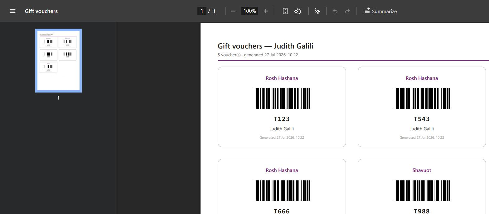

# Architecture

## The problem

A SharePoint list holds gift voucher batches. Each row is one *batch* for one *employee* —
a batch name in `Title`, the person in `Employee`, and all the voucher codes crammed into a
single text column as a semicolon-separated string:

| Title | Employee | QRCodes | Printed |
|---|---|---|---|
| Rosh Hashana | Judith Galili | `T123;T543;T666` | No |
| Shavuot | Judith Galili | `T988;T443` | No |

At a handout desk, an employee scans their card and needs a printable sheet with **one card per
voucher code** — not one card per row. So the work splits into three jobs: identify the person
from a scan, explode the batches into individual vouchers, and lay those vouchers out as a
printable PDF.

## The shape of the solution

```
  employee card                                                         printable PDF
       │                                                                      ▲
       ▼                                                                      │
┌──────────────┐   employee email    ┌────────────────┐   cards + bars   ┌────────────┐
│  Scan screen │ ──────────────────► │  SharePoint    │ ───────────────► │   Cloud    │
│  (text input)│                     │  GiftVouchers  │                  │   flow     │
└──────────────┘                     └────────────────┘                  └────────────┘
                                        ▲     │                                 │
                        Printed = Yes   │     ▼                                 ▼
                        once the sheet  │  ┌────────────────┐            HTML → PDF via
                        actually exists └──┤ Voucher screen │            SharePoint's
                                           │ (card gallery) │            Convert file
                                           └────────────────┘
```

Four moving parts. The barcodes are drawn, not fetched — see below for why that turned out to be
the load-bearing decision.

## 1. Identifying the employee

The card encodes the employee's email address (UPN). The `Employee` column is a SharePoint
person field, so the match is direct — no lookup table, no mapping list:

```powerfx
Filter(GiftVouchers, Employee.Email = gblScanId)
```

Equality on `Employee.Email` **is** delegable to SharePoint, so this stays correct past 2,000
rows. Case matters to the delegable form, which is why the scan is normalised once on the way
in rather than wrapped in `Lower()` inside the filter — `Lower()` on the left-hand side would
silently break delegation.

There is no camera and no barcode reader control. A handheld keyboard-wedge scanner simply types
the ID into a focused text box and presses Enter, which is why the text input uses
`DelayOutput: true` — Power Apps has no "on Enter" event for text inputs, but `DelayOutput` fires
`OnChange` once typing stops, which is exactly the behaviour a wedge scanner produces.
`SetFocus()` on screen entry keeps the box armed between employees.

## 2. Exploding the batches into cards

This is the only genuinely fiddly bit of Power Fx in the app. `Split()` turns one row's
`QRCodes` into a table, `AddColumns` attaches that table to its parent row, and `Ungroup`
flattens the nested result into one record per code:

```powerfx
ClearCollect(colCards,
    ForAll(
        Ungroup(
            AddColumns(colBatches, "Codes",
                Filter(Split(QRCodes, ";"), !IsBlank(Trim(Result)))
            ),
            "Codes"
        ),
        {
            Batch:     Title,
            Code:      Trim(Result),
            Employee:  gblEmployeeName,
            Generated: gblGeneratedAt
        }
    )
)
```

The inner `Filter(..., !IsBlank(Trim(Result)))` matters more than it looks. A trailing semicolon
(`T123;T543;`) is easy for a human to leave behind and would otherwise produce a blank voucher
card in the printed output.

`number` is deliberately **not** used as the source of truth. It is a convenience column that can
drift out of step with `QRCodes`; the codes themselves are authoritative. The app surfaces the
mismatch rather than trusting either side.

## 3. Drawing the barcode

Power Apps has no barcode generator — the built-in control only *reads*. The first build used a
free public QR service, which worked on screen and failed in the PDF for reasons covered in the
next section. What ships instead draws a **Code 39 barcode out of ordinary HTML elements**:

```html
<div class="bc"><i class="bn"></i><i class="sw"></i><i class="bn"></i>…</div>
```

```css
.bc { font-size: 0; white-space: nowrap; padding: 2mm 5mm; background: #fff; }
.bc i { display: inline-block; height: 14mm; vertical-align: top; }
.bn { width: 0.4mm; background: #000; }   /* narrow bar   */
.bw { width: 1.2mm; background: #000; }   /* wide bar     */
.sn { width: 0.4mm; background: #fff; }   /* narrow space */
.sw { width: 1.2mm; background: #fff; }   /* wide space   */
```

Code 39 is unusually well suited to being drawn this way. Every character is exactly nine
elements — five bars and four spaces, alternating, starting with a bar — of which exactly three
are wide. There is no checksum to compute and no data-dependent layout. So encoding is a table
lookup per character and nothing else, which is well within what Power Fx can do comfortably:

```powerfx
Concat(
    ForAll(Sequence(Len(s)) As ch,
        With({pat: LookUp(colC39, C = Mid(s, ch.Value, 1), P)},
            Concat(ForAll(Sequence(9) As el,
                "<i class=""" & If(Mod(el.Value,2)=1, "b", "s")
                              & If(Mid(pat, el.Value, 1)="w", "w", "n") & """></i>"), Value)
            & If(ch.Value < Len(s), "<i class=""sn""></i>", "")
        )
    ),
    Value
)
```

**Three details that decide whether it scans.**

`font-size: 0` on the container. Without it the whitespace between inline-block elements renders
as hairline white gaps and the barcode becomes unreadable — the single most likely thing to break
if someone tidies this CSS.

The **quiet zone**. Code 39 requires at least ten narrow widths of blank space either side. That
is the entire job of `padding: 2mm 5mm`, and tightening it to save space breaks scanning
completely rather than gradually.

The **wide-to-narrow ratio**, which must stay between 2.5:1 and 3:1. The two widths move together
or not at all.

### How the table was produced, and how it was checked

Not from memory. It was generated from a reference Code 39 implementation, then verified twice
over.

**Locally:** the bars were rendered, turned into a real A4 PDF, rasterised at 300 dpi — roughly
what an office laser puts on paper — and decoded with an independent barcode reader. All five
test codes came back exactly, including one with punctuation.

**Through the real pipeline:** the same markup was pushed to a live SharePoint library, converted
by the actual Convert file service, and the resulting PDF opened in a browser. All four barcodes
visible on screen decoded correctly *from a 1568-pixel screenshot* — noticeably worse than print
resolution, and they still read.



A hand-typed table is a genuinely dangerous idea here: one wrong element gives you a barcode that
looks perfect and scans as a *different* string, which is the worst failure mode a voucher can
have. [`tools/verify-barcodes.py`](../tools/verify-barcodes.py) re-runs the local half of that
check on demand.

### What this bought

No image, no font, no web request, no third party. The voucher codes never leave the tenant, and
the sheet renders identically whether or not the machine printing it has internet access.

The cost is the symbology. A Code 39 barcode holds uppercase letters, digits and a handful of
punctuation, and it is physically wider than a QR square. For voucher codes like `T123` that is
irrelevant; for anything long or case-sensitive it would not be.

## 4. The PDF

The app hands the flow three things — the employee name, a formatted timestamp, and the cards as
JSON — and gets back a URL:

```powerfx
Set(gblResult,
    GenerateGiftVoucherPDF.Run(
        gblEmployeeName,
        Text(gblGeneratedAt, "[$-en-US]dd mmm yyyy, HH:mm"),
        JSON(ShowColumns(colCards, "Batch", "Code", "Employee", "Bars"), JSONFormat.Compact)
    )
)
```

The flow assembles an A4 HTML page — a flex grid of cards with `page-break-inside: avoid` —
writes it to a document library, and calls SharePoint's **Convert file** action, which renders it
through the same Graph conversion service behind "Download as PDF" in Office. No premium
connector, no cost.

### What the test showed

This design was arrived at by testing, not by reading documentation, and the finding is worth
recording because it is not written down anywhere obvious.

SharePoint's Convert file action renders **server-side, with no network access**. Given a sheet
whose barcodes were `` tags pointing at a public QR service, it produced a flawless A4
layout — correct margins, two cards across, clean page breaks — and **an empty box where every
code should have been.** A follow-up probe with a base64 `data:` URI image rendered perfectly.

So the converter draws anything *embedded* in the file and refuses to fetch anything *referenced*
by it. That rules out any remotely-generated image, and it is why the barcodes are drawn as bare
HTML elements rather than fetched as pictures. Nothing in the output requires a single network
request.

### The alternative that was rejected

The app's native `PDF()` function renders in the user's browser, where a remote image loads
normally, so it would have kept the QR codes. It was rejected because `PDF()` has no
`page-break-inside` equivalent: on a long sheet a card gets sliced in half by a page boundary,
which for something you cut up with scissors is a real defect rather than a cosmetic one.

Server-side conversion plus a locally-drawn barcode gives both — correct page breaks *and* no
third party. That is strictly better than either half.

### Why the timestamp is computed in the app, not the flow

`utcNow()` inside the flow would be the *server's* clock at *conversion* time, in UTC. The
employee is standing at the desk; the time printed on their voucher should be the moment they
scanned, in their own timezone. So the app stamps it once and the flow only formats what it is
given.

## 5. The printed gate

`Printed` is a Yes/No column on the list. Rows that are already marked never make it into a
sheet:

```powerfx
ClearCollect(colAll,     Filter(GiftVouchers, Employee.Email = gblScanId));
ClearCollect(colBatches, Filter(colAll, Printed <> true));
ClearCollect(colDone,    Filter(colAll, Printed = true))
```

`Printed <> true` rather than `Printed = false` — a Yes/No column on rows that existed before you
added it is *blank*, not false, and `= false` would skip every one of them.

An employee whose rows are all marked gets told so by name and count, rather than an empty screen
or a blank sheet. The distinction between "I don't know you" and "you have already collected"
matters at a desk with a queue behind it.

Marking happens **after** the flow returns a URL, and only for the rows that were actually on the
sheet:

```powerfx
If(!IsBlank(gblResult.pdfurl),
    ForAll(colBatches As b,
        Patch(GiftVouchers, LookUp(GiftVouchers, ID = b.ID), { Printed: true })
    );
    Launch(gblResult.pdfurl),
    Set(gblError, "The sheet could not be generated. Nothing has been marked as printed — try again.")
)
```

**The gap this leaves.** If the flow succeeds and the `Patch` then fails — a dropped connection in
the half-second between them — the PDF exists but the rows are still unprinted, so the sheet can
be produced again. The window is small and it fails in the recoverable direction (a duplicate
print rather than a lost voucher), but it is a real gap.

Closing it properly means moving the marking into the flow, so the render and the mark happen in
one place: add an *Update item* action per row after step 7, and pass the row IDs in alongside the
cards. That is the right shape if these vouchers are ever worth money. It is not what is built
here, because it trades a small duplicate-print window for a larger one where a flow that fails
half way leaves rows marked as printed with no sheet to show for it — and that failure loses a
voucher rather than duplicating one.

**What this is not.** A Yes/No flag is not an issuance ledger. It records that a sheet was
produced, not that a human received it, and any site owner can clear it in two clicks. SharePoint's
own `Modified` and `Modified By` give you a rough audit trail for free, and if you need more than
rough, this is the wrong mechanism entirely.

## Trust and failure modes

| Situation | What happens |
|---|---|
| Unknown card scanned | Message on the scan screen; nothing navigates, box re-arms for the next scan |
| Employee has no voucher rows | Same path as unknown — treated as "nothing to hand out" |
| Every row already `Printed` | Named message with the count, so the desk can say why rather than guess |
| `QRCodes` blank on a row that exists | Row contributes zero cards; other batches still print |
| `number` disagrees with the actual code count | Cards are built from the codes; the app shows the real count |
| Flow fails | Error surfaced, nothing marked printed, the employee can try again |
| Flow succeeds, `Patch` fails | Sheet exists, rows stay unprinted — recoverable, but a duplicate print is possible |
| Printer jams, sheet never handed over | Rows are already marked. Someone has to clear `Printed` by hand |

That last row is worth sitting with. `Printed` records that a *file was produced*, not that a
person received anything. Paper jams, wrong tray, closed the tab — all of them leave an employee
empty-handed and their vouchers marked as collected. There is no way around that without a
confirmation step, and a confirmation step is a button someone will click reflexively. If these
vouchers are worth real money, the honest answer is that the desk needs a way to un-mark a row,
and the person staffing it needs to know it exists.

**What this still does not do.** It does not mark a voucher as *redeemed* — only as printed. It
does not check that the badge belongs to the person holding it. Anyone who can open the app and
knows a colleague's email can print that colleague's vouchers, once. If the codes are worth money,
read [the limitations](../README.md#-honest-limitations) before deploying it.

## Swapping the symbology

Code 39 was chosen because it is trivially drawable — no checksum, fixed nine-element characters,
no data-dependent layout. If you need something else:

- **Code 128** is denser and handles the full ASCII range, but requires a modulo-103 checksum and
  three shifting character sets. Computable in Power Fx; noticeably more code, and much more worth
  unit-testing.
- **A QR code** cannot realistically be drawn this way — Reed–Solomon error correction and mask
  selection are far past what belongs in a Power Fx expression. If you need QR specifically, you
  need something that can produce image bytes: an Azure Function returning a PNG as a `data:` URI
  (which the converter *will* render), or a PCF component if the preview is all you need.

Whatever you choose, the app and the flow must agree — the app builds the markup, the flow only
places it, and the stylesheet that gives those elements their widths lives in
[`flow/voucher-sheet.html`](../flow/voucher-sheet.html).
